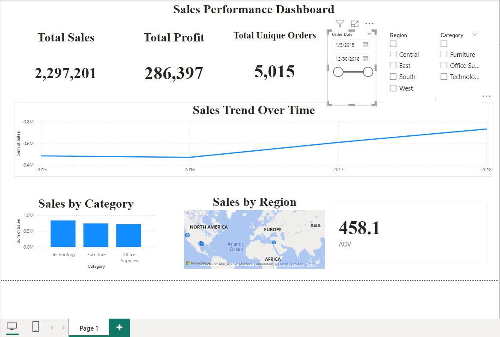

# 📊 Sales Performance Dashboard (Power BI)
## 🔍 Project Overview
This project presents an interactive **Sales Performance Dashboard** built using Power BI to analyze business metrics such as **Sales, Profit, and Order Trends**.
The dashboard enables users to explore performance across different regions, categories, and time periods for better decision-making.
## 📁 Dataset
* Source: Superstore dataset
* Includes:
  * Orders
  * Sales
  * Profit
  * Customers
  * Regions
  * Categories
## 📌 Key Features
* 📈 Sales trend analysis over time
* 🌍 Regional performance visualization
* 📦 Category-wise sales breakdown
* 📊 KPI cards for:
  * Total Sales
  * Total Profit
  * Total Unique Orders
* 🎯 Interactive filters (Region, Category, Date)
## 🛠️ Tools & Technologies
* Power BI
* Data Visualization
* Data Cleaning & Modeling
## 📷 Dashboard Preview

## 📂 Project Files
* `sales_dashboard.pbix` → Power BI dashboard file
* `superstore.csv` → Dataset
* `dashboard.png` → Dashboard screenshot
## 🚀 Insights
* Sales show a consistent upward trend over time
* Technology category generates highest revenue
* Regional performance varies significantly across markets
## 📌 How to Use
1. Download `.pbix` file
2. Open in Power BI Desktop
3. Interact with filters and visuals
## 👤 Author
**Prabhukumar Siriprolu**
